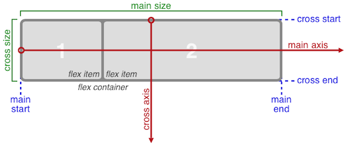

# Proprietà
- La proprietà `box-sizing: border-box` ci permette di includere nel conteggio totale dell'altezza e largezza dell'elemento il padding e il border. Se due elementi aventi stessa altezza e larghezza, ma padding differente, senza questa proprietà avranno dimensioni diverse. [W3C](https://www.w3schools.com/css/css3_box-sizing.asp)

## Flexbox
[CSS-Tricks Flexbox Layout](https://css-tricks.com/snippets/css/a-guide-to-flexbox/)
- La proprietà `flex` rende l'elemento a cui è applicata un `flex container`, e gli elementi figli contenuti in questo container diventano dei `flex items` (su questi items non hanno effetto le proprietà _float_, _clear_ e _vertical-align_). Inoltre quando si lavora con il layout flexbox bisogna pensare nei termini dei due assi: 

### Proprietà per il flex container
- `flex-direction` definisce l'asse principale.
- `flex-wrap` ci permette di disporre i flex items su più linee, se questi non rientrano su una.
- `justify-content` definisce l'allineamento lungo l'asse principale.
- `align-items` definisce come disporre i flex items lungo la cross-axis.
- `align-content` allinea le linee del flex container quando c'è spazio extra tra esse lungo il cross-axis.

### Proprietà per i flex items
- `order` controlla l'ordine in cui i flex items appaiono.
- `flex-grow` definisce l'abilità di un flex item di espandersi se necessario.
- `flex-shrink` definisce l'abilità di un flex item di rimpicciolirsi se necessario.
- `flex-basis` definisce la dimensione predifinita di un elemento prima che lo spazio rimanente sia distribuito.
- `align-self` permette di modificare l'allineamento predifinito dei flex items (lungo la cross-axis quindi).

# Pseudo-classi
- La pseudo-classe `:nth-child()` "seleziona" uno o più elementi in base alla loro posizione in un gruppo di fratelli. [Mozilla Developer](https://developer.mozilla.org/en-US/docs/Web/CSS/:nth-child)

- La pseudo-classe `nth-last-child()` seleziona uno o più elementi in base alla loro posizione in un gruppo di fratelli, così come la :nth-child, contando però dalla fine. [Mozilla Developer](https://developer.mozilla.org/en-US/docs/Web/CSS/:nth-last-child)

- La pseudo-classe `:last-child` seleziona l'ultimo elemento di un gruppo di elementi "fratelli".

- Il selettore `>` è utilizzato per selezionare gli elementi con uno specifico genitore. [W3C](https://www.w3schools.com/cssref/sel_element_gt.asp)

# Sticky footer
Si utilizza un div con tutto il contenuto della pagina tranne il footer, che avrà:  
`flex-grow:1, flex-shrink: 0, flex-basis: auto`;  
mentre il footer avrà `flex-shrink: 0`. [CSS-Tricks Sticky-Footer](https://css-tricks.com/couple-takes-sticky-footer/)